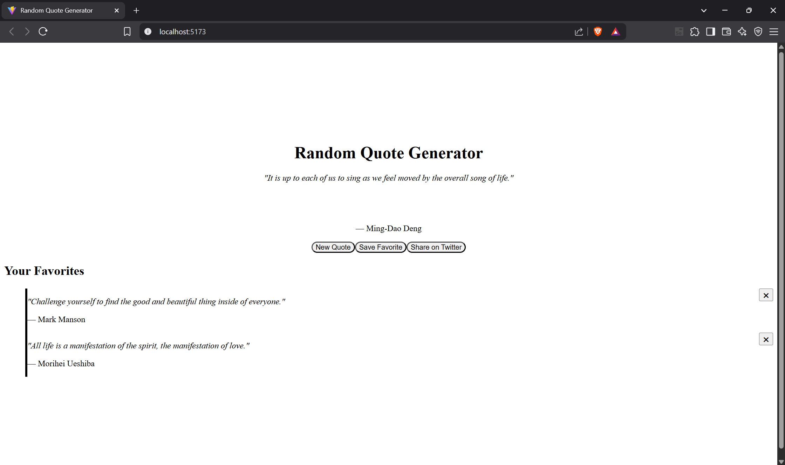

# 📜 Random Quote Generator

A sleek and minimalist React application that displays random quotes using the [ZenQuotes API](https://zenquotes.io). Users can generate new quotes, save their favorites, and share them directly to Twitter.



## 🚀 Features

- 🎲 Fetches random inspirational quotes
- 💾 Save your favorite quotes to local storage
- 🐦 Share quotes on Twitter with one click
- 🌈 Beautiful UI with TailwindCSS
- 🔄 Loading state with disabled button
- 🗑️ Option to delete saved quotes

## 📦 Tech Stack

- **React** (with Hooks)
- **TailwindCSS**
- **LocalStorage**
- **ZenQuotes API** (via proxy to bypass CORS)

## 🛠️ Installation

```bash
git clone https://github.com/udaykallam/Random-Quote-Generator.git
cd Random-Quote-Generator
npm install
npm run dev
